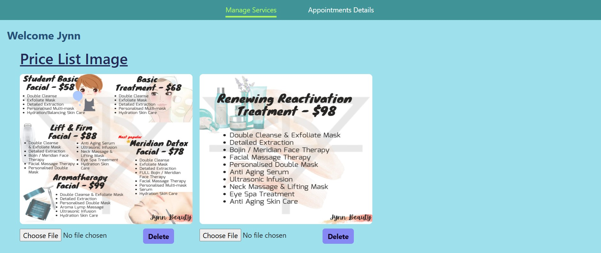
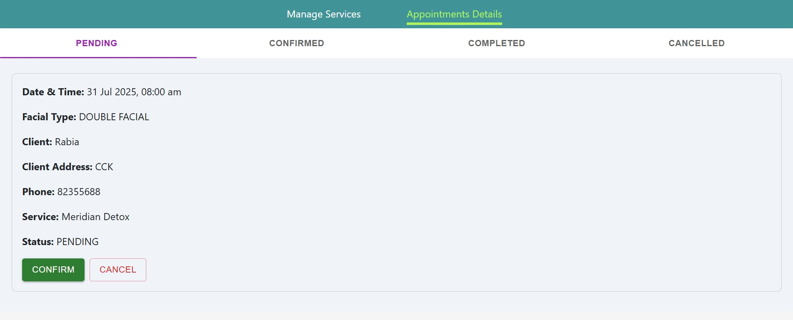
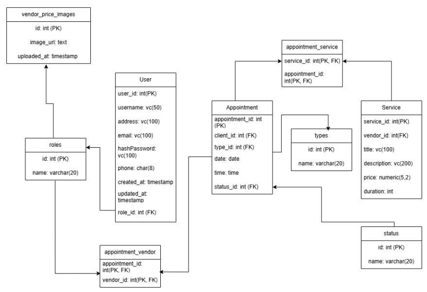

# 🧴💆‍♀️ Beauty Appointment App

A full-featured web application for managing beauty service appointments. Designed for beauticians and clients,this app allows smooth booking, service management, and schedule tracking — perfect for door-to-door beauty services.




---

## Project Hierarchy

```
Home / Dashboard
|------ Authentication
		|------Login / Register
|------ Client
		|------Book Appointment
		|------My Appointments
|------ Vendor
		|------Manage Services (Create / Edit / Delete)
		|------Appointments Details
				|------ Pending Appointment
				|------Confirm Appointment
				|------ Complete Appointment
				|------ Cancel Appointment
```

---

## ✨ Features

### 👫 Client

- Register and log in securely
- View available services and beauticians
- Book appointments (select date, time, location)
- View and cancel upcoming appointments

### 💆‍♀️ Vendor (Beautician)

- Log in to view their schedule
- Manage available services
- Update appointment status (e.g. confirmed, completed, canceled)
- View client information

---

## Tech Stack

### Front-End

- JavaScript
- HTML
- CSS
- React
- UI Library: Material UI (MUI)

### Back-End

- Node.js
- Express.js
- express-validator

### Database

- PostgreSQL

---

### Environment Variables

---

You will need an .env file with the following variables:

```plaintext
DATABASE_URL=postgresql://your_database_connection_string
PORT=5001
ACCESS_SECRET=your_own_access_token_secret
REFRESH_SECRET=your_own_refresh_token_secret
JWT_SECRET=your_own_jwt_secret
CLOUDINARY_CLOUD_NAME=your_cloudinary_cloud_name
CLOUDINARY_API_KEY=your_cloudinary_api_key
CLOUDINARY_API_SECRET=your_cloudinary_api_secret
```

---

## Next Steps

- Calendar view for vendors (beauticians) to see their appointment schedules
- Admin role with full access to manage users, services, and appointments
- Monthly income overview for beauticians, with visual charts and breakdowns
- Prevent clients from booking appointments that overlap with existing bookings (time conflict prevention)

---

## 🧩 Data Schema Overview


